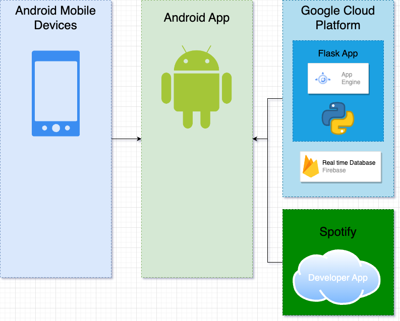
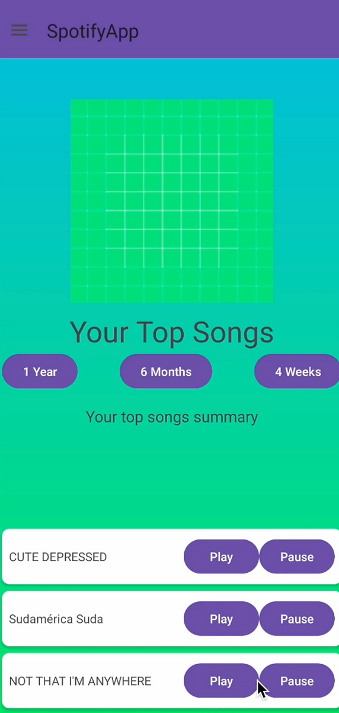

# Spotify App
This website showcases an innovative app designed to analyze your Spotify information and offer personalized recommendations and insights based on your Spotify Wrapped. This platform also features a dedicated team page introducing the talented individuals behind the project, a detailed design process page, a comprehensive project explanation page, and an interactive project demo page.
Android 33 Tiramisu Frontend Python 3.9.6 Flask Backend hosted on GCP App Engine

[Link to Portfolio Site](https://andregro21.wixsite.com/felipe4project/process-description)

Architecture: 

Demo: 

